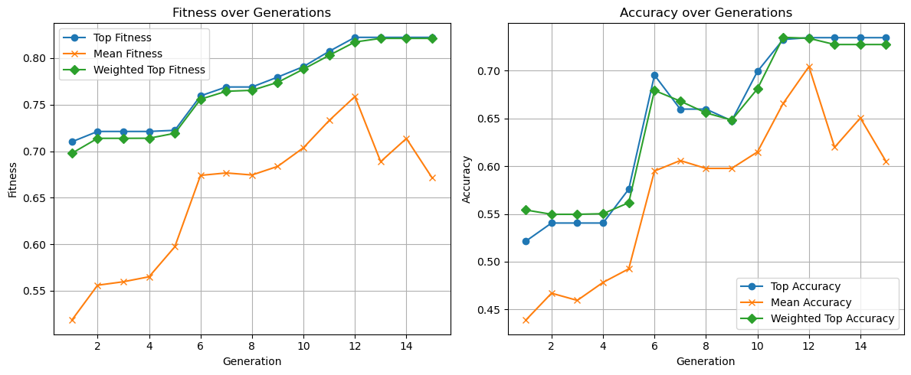

## Quantum Genetic NAS

### Quantum Genetic Algorithm (QGA) for Neural Architecture Search (NAS) on CIFAR-10

This project implements a custom **Quantum Genetic Algorithm (QGA)** for **automated neural architecture search (NAS)** using the **CIFAR-10** dataset. It combines quantum-inspired optimization with classical deep learning to evolve effective and efficient convolutional neural networks.

---

### Highlights

- **Quantum-inspired**: Simulates qubits with probability amplitudes and quantum rotation gates to guide search.
- **Custom NAS Encoding**: Chromosome structure encodes variable-length CNN architectures (conv layers, pooling, activations, dropout, etc).
- **Fitness Function**: Balances accuracy with model complexity (parameter count).
- **Dynamic Evolution Phases**: Adapts learning strategy across generations (exploration → focus → convergence).
- **Dynamic Top-K Strategy**: Uses ensemble voting over the top-k chromosomes each generation to create a weighted target chromosome.
- **Progress Tracking**: Fitness/accuracy tracked across generations, model complexity reported.
- **Built with Keras + TensorFlow** and fully compatible with modern scientific Python stack.

---

### File Structure

| File | Description |
|------|-------------|
| `quantum_genetic.py` | Core QGA implementation, including chromosome encoding, fitness, and evolution logic |
| `qga_trainer.ipynb` | Jupyter Notebook to train and evaluate models on CIFAR-10 using the QGA |
| `README.md` | You're here! |

---

### Chromosome Design

Each chromosome encodes:
- Up to **4 convolutional layers** (filters, kernel size, activation, pooling, batch norm)
- Up to **4 dense layers** (neurons, activation, dropout)
- Designed to explore a **search space of thousands of unique CNN topologies**

---

### Fitness Function

Fitness balances **validation accuracy** and **log-scaled model complexity**:

$$
\text{fitness} = \alpha \cdot \sqrt{\text{accuracy}} - (1 - \alpha) \cdot \text{scaled complexity}
$$

Where α = 0.8 (by default), encouraging compact yet performant models.

---

### Results & Output

The notebook outputs:
- Generation-wise logs of accuracy, fitness, model size
- Best model architecture found
- Summary of performance metrics
- Optionally, confusion matrix visualization for final model


---

### Requirements

- Python 3.8+
- TensorFlow / Keras
- NumPy, tqdm, matplotlib, scikit-learn

Install dependencies:
```bash
pip install -r requirements.txt
```

---

### Getting Started

```python
# In qga_trainer.ipynb:
manager = QuantumPopulationManager(input_shape=(32, 32, 3), generations=15)
best_arch, best_fitness, scores = manager.run_evolution((X_train, y_train, X_test, y_test))
```

You can customize:
- `BALANCE_PCT` (accuracy vs. complexity)
- `CHROMOSOME_LEN` and layer encodings
- Evolution phases (population size, θ, training epochs)

---

### Contact & Author

Created by Bradley Abelman  
LinkedIn: [babelman](https://www.linkedin.com/in/babelman)

---

### Why This Matters

This project showcases a **novel hybrid algorithm** that combines:
- Theoretical CS concepts (quantum computing, genetic algorithms)
- Deep learning engineering (Keras model composition)
- Automated model design (AutoML / NAS)

It’s ideal for:
- Employers evaluating ML optimization skills
- Research or startup teams looking into AutoML
- Anyone exploring advanced metaheuristic search strategies

